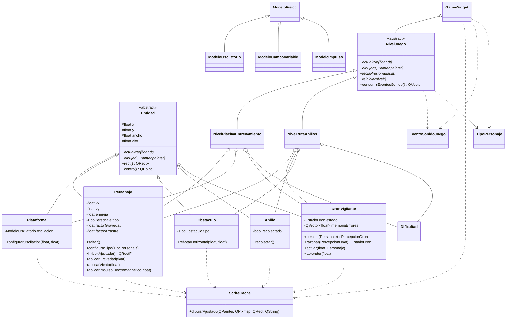

# Diagrama de clases resumido

## Puntos para sustentar

- Herencia propia: `Entidad` es la base de personajes, plataforma, anillos, obstaculos y dron. `NivelJuego` permite manejar niveles distintos con polimorfismo.
- Memoria dinamica: los niveles y entidades usan `std::unique_ptr`, manteniendo memoria dinamica con propiedad clara y liberacion automatica.
- Contenedores: `NivelRutaAnillos` usa `std::vector` para anillos y obstaculos; `DronVigilante` usa `QVector` como memoria de aprendizaje.
- Eficiencia: `SpriteCache` evita reescalados repetidos de pixmaps durante el render.
- Fisicas: gravedad/parabola, viento/turbulencia, friccion, poderes parametrizados, piscina con aceleracion y oscilacion senoidal.
- Agente inteligente: el dron separa percepcion, razonamiento, accion y aprendizaje.
- Sonido: cada nivel emite eventos (`salto`, `anillo`, `colision`, `agua`, `nivel`) y `GameWidget` los reproduce con `QSoundEffect`.
